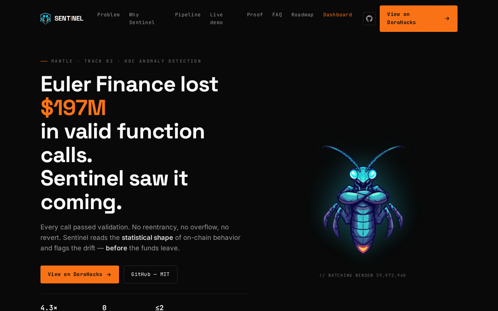
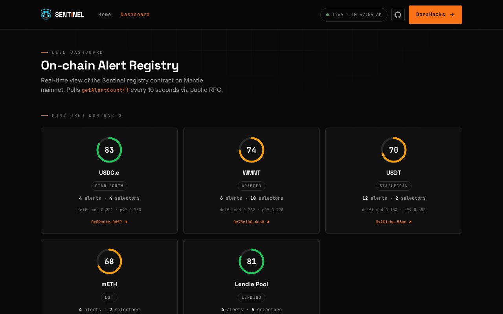
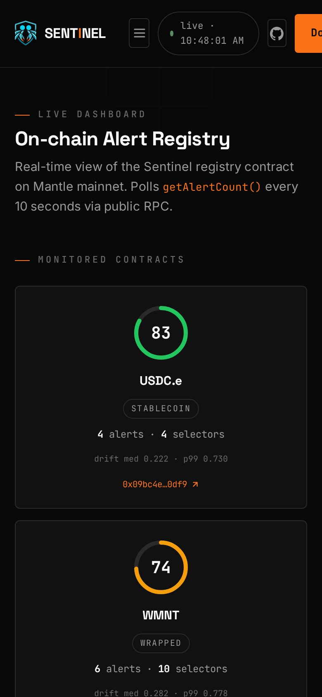

# Mantle Sentinel — HDC Behavioral DNA Agent

[](https://github.com/alexbelij/mantle-sentinel/actions/workflows/pytest.yml)


> Your smart contracts have a behavioral fingerprint. Sentinel knows when it changes.

**Built for [Mantle AI Hackathon — Turing Test Phase II](https://dorahacks.io/hackathon/mantle-ai/detail), Track 02: AI Alpha & Data**

[Live Demo](https://mntsentinel.xyz) · [Dashboard](https://mntsentinel.xyz/dashboard/) · [Contract on Mantlescan](https://mantlescan.xyz/address/0x0899E1507CFfefF8620455721F5bd528Bb072187)

---

## Results

| Metric                        | Sentinel                     | Signature baseline |
| ----------------------------- | ---------------------------- | ------------------ |
| Clean/attack separation ratio | **4.3×** (USDC.e real data)  | ~1.2×              |
| Detection delay               | ≤2 windows (≤100 txs)        | 4+ windows         |
| False positive rate           | **0** episodes (USDC.e)      | —                  |

*Data: 3,993 real Mantle USDC.e transactions. Full methodology:
[`docs/BENCHMARK_PROTOCOL.md`](docs/BENCHMARK_PROTOCOL.md).*

### Injection scenarios

| Scenario          | Signature                       | Detected | Delay     |
| ----------------- | ------------------------------- | -------- | --------- |
| S1 selector flood | New selectors dominate          | ✅       | 2 windows |
| S3 gas shift      | Gas 5× above baseline           | ✅       | 3 windows |
| S5 timing burst   | Near-zero inter-tx interval     | ✅       | 2 windows |
| S7 payload mutation | Randomized calldata           | ✅       | 4 windows |

## Screenshots

| Landing | Dashboard | Mobile |
|---------|-----------|--------|
|  |  |  |

---

## Live Scan — Top Mantle DeFi Contracts

One command, zero config. `sentinel scan` fetches on-chain history and runs the
full HDC pipeline:

```bash
python -m sentinel scan 0x09bc4e0d864854c6afb6eb9a9cdf58ac190d0df9
```

| Contract | Protocol | Health | Drift (median) | Drift (p99) | Selectors | Alerts |
|----------|----------|--------|----------------|-------------|-----------|--------|
| 0x09bc4e… | USDC.e | 83/100 | 0.222 | 0.730 | 4 | 4 |
| 0x78c1b0… | WMNT | 74/100 | 0.282 | 0.778 | 10 | 6 |
| 0x201eba… | USDT | 70/100 | 0.153 | 0.656 | 2 | 12 |
| 0xcda86a… | mETH | 68/100 | 0.274 | 0.978 | 2 | 4 |
| 0xcfA5aE… | Lendle Pool | 81/100 | 0.317 | 0.706 | 5 | 4 |

Full reports: [`bench/reports/`](bench/reports/) · Summary: [`bench/reports/SUMMARY.md`](bench/reports/SUMMARY.md)

---

## The Problem

Signature-based tools miss novel attacks. Pure-LLM monitors are slow and expensive.
Sentinel detects **change itself** — deterministic, per-transaction, microsecond
updates — using a 10,000-dimensional hyperdimensional (HDC) behavioral signature,
and only *then* asks Z.ai to explain the confirmed alert in plain English.
The model is **never** in the detection loop.

---

## Key Features

- **Training-free anomaly detection** — 10,000-dim HDC behavioral fingerprint, zero GPU, zero retraining
- **On-chain proof** — every alert is anchored to the Sentinel registry contract on Mantle mainnet
- **Telegram alerts** — real-time notifications via [@MantleSentinelBot](https://t.me/MantleSentinelBot)
- **Z.ai explanations** — confirmed alerts get a plain-English brief from Z.ai GLM
- **Live dashboard** — real-time drift gauge and alert table at [mntsentinel.xyz/dashboard](https://mntsentinel.xyz/dashboard/)

---

## How It Works

```
  [Mantle RPC]
      │
  T0  Entropy pre-filter (calldata selector distribution)
      │
  T1  HDC Encoder — 10,000-dim bipolar hypervector per window
      │
  T2  Drift = max(Hamming distance, timing deviation)
      │
  T3  Detector — static threshold or BOCPD regime-change
      │
  T4  Feature attribution (ablation: recompute bundle without feature f)
      │
  T5  Z.ai natural-language explanation (restates Tier-4 findings only)
      │
  [Telegram alert  +  on-chain logAlert()  +  Dashboard]
```

Attribution is computed **algebraically before** Z.ai is ever called — the
structured explanation exists with or without the LLM.

---

## Comparison

|                 | Sentinel       | Forta         | Chainalysis    | LLM monitor   |
|-----------------|----------------|---------------|----------------|---------------|
| **Training**    | None           | Per-bot       | Signatures     | Fine-tune     |
| **Detection**   | Algebraic      | Rule / ML     | Pattern DB     | Prompt        |
| **Speed**       | <1 µs/tx       | Seconds       | Batch          | 1–5 s/tx      |
| **GPU**         | No             | Optional      | No             | Required      |
| **Novel attacks** | ✅           | ❌            | ❌             | Partial       |

---

## Quick Start

```bash
git clone https://github.com/alexbelij/mantle-sentinel
cd mantle-sentinel
pip install -r requirements.txt

# self-attack demo — works immediately, zero config:
python bench/self_attack.py --dry-run

# scan any Mantle contract (needs ETHERSCAN_KEY):
python -m sentinel scan 0x09bc4e0d864854c6afb6eb9a9cdf58ac190d0df9
```

Set `TELEGRAM_BOT_TOKEN` + `TELEGRAM_CHAT_ID` in `.env` to enable Telegram alerts via [@MantleSentinelBot](https://t.me/MantleSentinelBot).

## CI/CD Integration

Sentinel runs as a health gate in your pipeline:

**GitHub Actions** — scheduled weekly scan with `--min-health` threshold.
See [`.github/workflows/sentinel-scan.yml`](.github/workflows/sentinel-scan.yml).

**Pre-commit** — block pushes if contract health drops below threshold.
```bash
pip install pre-commit && pre-commit install
```

**Any CI** — exit code 0 = healthy, 1 = below threshold:
```bash
python -m sentinel scan <addr> --min-health 60
```

To replay the real USDC.e snapshot (gitignored — fetch it first):

```bash
cp .env.example .env                    # add ETHERSCAN_KEY + TELEGRAM_*
python bench/capture_etherscan.py       # downloads raw.jsonl (~4k txs)

python -m sentinel replay \
  --snapshot bench/data/0x09bc4e0d864854c6afb6eb9a9cdf58ac190d0df9/raw.jsonl \
  --inject S1
```

Live on-chain mode (warm up, inject anomalies, anchor alert on Mantle):

```bash
pip install web3 eth-account
export MANTLE_PRIVATE_KEY=0x...         # see .env.example
python bench/self_attack.py \
  --victim 0x1f88f063C00893642Ca4a74FE4d25Bf20c468E64 \
  --rpc https://rpc.sepolia.mantle.xyz
```

---

## Contract — `SentinelAlertRegistry` v2

Immutable, owner-gated on-chain registry for behavioral-drift alerts.
Source: [`contracts/SentinelAlertRegistry.sol`](contracts/SentinelAlertRegistry.sol).

| Network            | Chain ID | Address                                      |
| ------------------ | -------- | -------------------------------------------- |
| **Mantle Mainnet** | 5000     | `0x0899E1507CFfefF8620455721F5bd528Bb072187` |
| Mantle Testnet     | 5003     | `0x2543Cc701632b105eE3DB75345140a7357664389` |

Explorer: [mantlescan.xyz/address/0x0899…72187](https://mantlescan.xyz/address/0x0899E1507CFfefF8620455721F5bd528Bb072187)

`driftScore` is stored ×10 000 (`0.87` → `8700`). Events carry the storage
`alertIndex` so any off-chain consumer reconstructs the timeline without
array scans. Reads (`getAlertCount`, `getAlert`, `getLatestAlerts`) are O(1)
or bounded-gas.

---

## Z.ai Integration

[`sentinel/explain_zai.py`](sentinel/explain_zai.py) calls Z.ai (OpenAI-compatible
`chat/completions`) on every confirmed alert, **after** Tier-4 attribution.
Z.ai only restates the structured findings — it cannot create or suppress an
alert. Prompt template + schema: [`docs/zai_prompt.md`](docs/zai_prompt.md).

- Endpoint: `https://api.z.ai/api/paas/v4` · model `glm-4.5-flash` (free tier)
- No `ZAI_API_KEY` → deterministic dry-run explanation (CI never hits the API)
- Alert payload schema: [`contracts/alert.schema.json`](contracts/alert.schema.json)

---

## Tests

```
python -m pytest tests/ -q     # 129 passed
forge test                     # 6 passed  (contracts/SentinelAlertRegistry.sol)
```

CI: GitHub Actions runs the Python suite on every push / PR:
[`.github/workflows/pytest.yml`](.github/workflows/pytest.yml).
Contract tests run locally via Foundry (`forge test`).

---

## Repo layout

```
sentinel/          Python package — Tiers T0–T5 pipeline
  prefilter.py     T0  entropy pre-filter
  hdc.py           T1  hyperdimensional encoder
  drift.py         T2  Hamming + timing drift
  detector.py      T3  static / BOCPD detector
  bocpd.py             Bayesian online change-point detector
  interpreter.py   T4  feature-ablation attribution
  explain_zai.py   T5  Z.ai explainer + contract profiler (dry-run safe)
  scan.py              one-command behavioral audit
  notify_telegram.py   Telegram fan-out
  replay.py            snapshot replay harness
contracts/         SentinelAlertRegistry.sol (v2) + VictimCounter.sol + ABI/deployments
test/              Foundry tests (forge)
tests/             pytest suite
bench/             self_attack.py demo + real snapshot data + scan reports
dashboard/         static on-chain alert viewer
docs/landing/      marketing site (Vercel)
```

---

**Track:** AI Alpha & Data · **Hackathon:** [Mantle Turing Test Phase II](https://dorahacks.io/hackathon/mantle-ai/detail)
