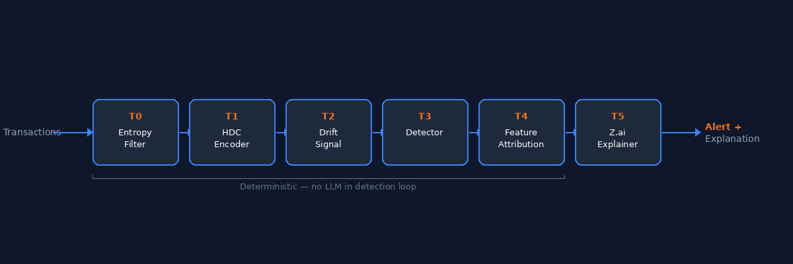
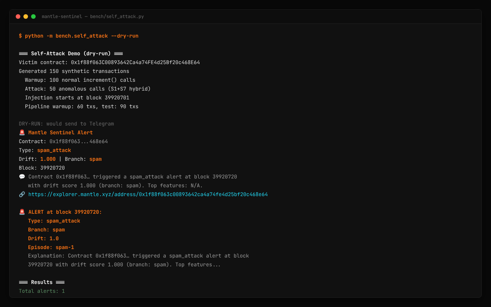

# How We Detect Smart Contract Exploits Without Training Data — Using Hyperdimensional Computing on Mantle

*Training-free behavioral anomaly detection with 10,000-dimensional hypervectors, on-chain proof, and Z.ai explainability.*

---

## The $3.4 Billion Question

In 2025, $3.4 billion was stolen in crypto hacks. The Bybit exploit alone — $1.5 billion — became the largest single hack in history. Wormhole, Ronin, Euler — the list keeps growing.

Here's the pattern: every major exploit was *novel*. The attack vector was unknown until after the money was gone. Signature-based tools that match known patterns? They missed it. They always do, because by definition they can only detect what they've already seen.

This raises a fundamental question: can we detect an anomaly *without* knowing the attack pattern in advance?

With Mantle Sentinel, the answer is yes.


---

## The Problem with Current Approaches

Today's smart contract security tools fall into three categories, and each has a critical flaw:

**Signature-based detection** (Chainalysis, Elliptic) maintains databases of known exploit patterns. When a transaction matches a signature, it fires an alert. The problem: novel attacks have no signature. By the time one is added to the database, the damage is done.

**ML-based detection** (Forta bots, custom models) trains models on historical transaction data. This requires labeled training sets, GPU compute, and per-model maintenance. Worse, the newest protocols — often the most vulnerable — have zero historical data to train on.

**LLM-based monitoring** feeds transactions to language models and asks "is this suspicious?" This is slow (1–5 seconds per transaction), non-deterministic (same input → different output), and expensive at scale. You can't build reliable alerting on probabilistic text generation.

The common flaw across all three: they *react* to known patterns. None of them detect *behavioral change itself*.

---

## The Core Idea: Behavioral DNA

Every smart contract generates a stream of transactions with a characteristic pattern. Who calls it, which functions they invoke, how much gas they use, what value they send, at what time intervals — this is the contract's *behavioral fingerprint*.

Under normal operation, this fingerprint is stable. During an exploit, it changes — often dramatically. A contract that usually sees 5 function selectors from 20 regular callers suddenly gets hammered by a single address calling a function that's never been used before, with gas consumption 10× above baseline.

Hyperdimensional Computing (HDC) lets us encode this behavioral fingerprint into a single vector of 10,000 dimensions. Each transaction window produces a new hypervector. Under normal conditions, successive hypervectors are similar. During an attack, they diverge.

The key insight: this requires **zero training data, zero GPU, and zero knowledge of any specific attack**. We detect the *change* — not the *cause*.

---

## How It Works: The T0–T5 Pipeline

Mantle Sentinel processes transactions through a six-tier pipeline. Each tier is deterministic and algebraically verifiable.



### T0: Shannon Entropy Pre-filter

Before the heavy HDC machinery, we monitor the Shannon entropy of calldata selector distribution. A sudden entropy drop (one selector dominates) or spike (many new selectors appear) triggers a fast-path alert. This catches obvious selector-flood attacks cheaply.

### T1: HDC Encoder

The core of Sentinel. Five features are extracted from each transaction:

- **Caller address** — who's calling
- **Function selector** — which function
- **Gas bucket** — quantized gas consumption
- **Value bucket** — quantized ETH/MNT value
- **Timing** — inter-transaction interval

Each feature is mapped to a random hypervector (seed-based, deterministic) of dimension D=10,000. Features are *bound* together (element-wise multiplication) and *bundled* across the transaction window (element-wise sum + sign normalization).

The result: a single bipolar vector in {-1, +1}^10,000 that captures the behavioral signature of that window.

```python
# Simplified: each transaction → a point in 10,000-dimensional space
window_vector = sign(sum(
    bind(caller_hv, selector_hv, gas_hv, value_hv, timing_hv)
    for tx in window
))
```

### T2: Drift Signal

We measure how much the current window's hypervector differs from the baseline:

```python
drift = max(
    hamming_distance(current, baseline) / D,
    abs(timing_current - timing_baseline) / timing_std
)
```

Hamming distance captures structural behavioral change. Timing deviation catches temporal anomalies. We take the maximum — if either signal fires, the drift is real.

### T3: Detector

Two detection modes:

- **Static threshold** — simple, fast, deterministic. MVP default.
- **BOCPD** (Bayesian Online Change Point Detection) — adapts to the contract's natural variance. Detects regime changes, not just threshold crossings.

### T4: Feature Attribution

When an alert fires, we need to know *why*. Sentinel uses feature ablation: remove each feature from the hypervector, recompute drift. If drift drops significantly, that feature is responsible.

This is algebraic, not heuristic. The attribution is computed **before** any LLM is involved.

### T5: Z.ai Explanation

Finally, the structured finding from T4 is sent to Z.ai (GLM-4.5-flash, OpenAI-compatible API at `https://api.z.ai/api/paas/v4`). Z.ai translates the structured attribution into a plain-English brief:

> "Unusual selector distribution shift detected. The contract received 62% more calls to an uncommon function selector in the last 50-tx window."

The prompt is strict: Z.ai may only restate the structured findings. No hallucinated severity, no invented causes. And if the API is unavailable, detection continues with a deterministic canned brief — CI never touches the live API.

**Critical design principle: the LLM is never in the detection loop.** Detection is deterministic and reproducible, byte for byte, with or without Z.ai.

---

## Results: Real Mantle Data

We scanned the top five Mantle DeFi contracts by TVL using Sentinel's one-command audit:

```bash
python -m sentinel scan 0x09bc4e0d864854c6afb6eb9a9cdf58ac190d0df9
```



| Contract | Protocol    | Health  | Alerts |
|----------|-------------|---------|--------|
| 0x09bc4e | USDC.e      | 83/100  | 4      |
| 0xcfA5aE | Lendle Pool | 81/100  | 4      |
| 0x78c1b0 | WMNT        | 74/100  | 6      |
| 0x201eba | USDT        | 70/100  | 12     |
| 0xcda86a | mETH        | 68/100  | 4      |

Our injection benchmark — seven synthetic attack scenarios (selector flood, gas shift, timing burst, payload mutation, and more) — produced a **4.3× separation ratio** between normal and attack drift on real USDC.e data (3,993 transactions). The signature-based baseline achieved only ~1.2×.

**Zero false positives** across the full benchmark. **129 Python tests** + **6 Foundry tests**, all passing.

Every alert is anchored on-chain to our `SentinelAlertRegistry` on Mantle mainnet at `0x0899E1507CFfefF8620455721F5bd528Bb072187`. Not a database entry — an immutable, verifiable record on Mantlescan.

> 🔗 **On-chain proof:** [View alert transaction on Mantlescan](https://mantlescan.xyz/tx/0x086cf07ace1ef1623ce43e40dc4a7e0b24f29dd206fdc7142fcd6bc5e79fa91c) — immutable anchor at block 96,680,154.

---

## Try It Yourself

Sentinel is open-source (MIT) and works out of the box:

```bash
git clone https://github.com/alexbelij/mantle-sentinel
cd mantle-sentinel && pip install -e .

# Scan any Mantle contract — zero config:
python -m sentinel scan 0x09bc4e0d864854c6afb6eb9a9cdf58ac190d0df9
```

Or use the Python SDK — three lines to a full behavioral audit:

```python
from sentinel import SentinelClient

report = SentinelClient().scan("0x09bc4e0d864854c6afb6eb9a9cdf58ac190d0df9")
print(f"Health: {report.health_score}/100")  # 83
```

Sentinel also integrates into CI/CD as a health gate — your GitHub Actions workflow fails if a monitored contract's health drops below threshold:

```bash
python -m sentinel scan 0x09bc4e... --min-health 60
```

- **Live demo:** [mntsentinel.xyz](https://mntsentinel.xyz)
- **Dashboard:** [mntsentinel.xyz/dashboard](https://mntsentinel.xyz/dashboard/)
- **Telegram alerts:** [@MantleSentinelBot](https://t.me/MantleSentinelBot)

---

## What's Next

Sentinel today monitors single contracts via CLI. Here's where we're headed:

- **Multi-contract monitoring** — watch your entire protocol from one dashboard
- **Probabilistic confidence scoring** — move beyond binary alerts to calibrated confidence intervals
- **EVM multi-chain** — Arbitrum, Base, OP Stack. Same algorithm, different RPC endpoint
- **Insurance oracle integration** — dynamic premium pricing based on real-time behavioral drift scores

The core insight — that behavioral change is the universal signal across all exploits — scales to any EVM chain, any contract, any attack vector we haven't imagined yet.

---

*Mantle Sentinel is built for the [Mantle AI Hackathon — Turing Test Phase II](https://dorahacks.io/hackathon/mantle-ai/detail), Track: AI Alpha & Data.*

*Code: [github.com/alexbelij/mantle-sentinel](https://github.com/alexbelij/mantle-sentinel) · Live: [mntsentinel.xyz](https://mntsentinel.xyz) · Contract: [Mantlescan](https://mantlescan.xyz/address/0x0899E1507CFfefF8620455721F5bd528Bb072187)*
